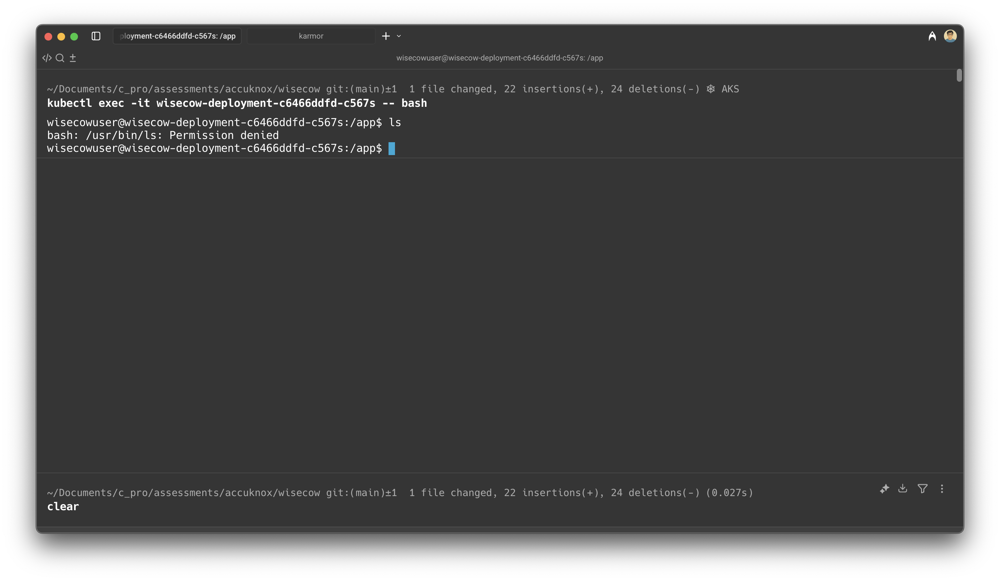
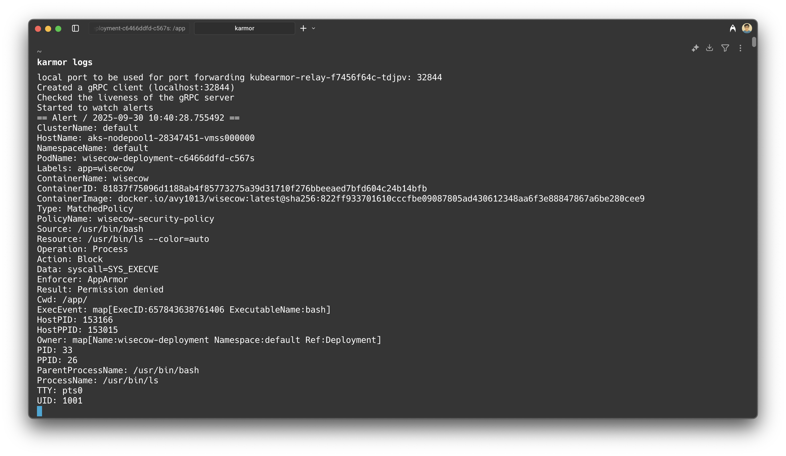

# Wisecow: Secure Kubernetes Deployment with CI/CD & Zero-Trust Policy

## Overview

This repository demonstrates the **containerization**, **secure deployment**, and **zero-trust runtime protection** of the [Wisecow application](https://github.com/nyrahul/wisecow) on Kubernetes.  
It covers Dockerization, Kubernetes manifests, automated CI/CD with GitHub Actions, TLS setup, and a KubeArmor zero-trust policy plus **bash scripts**.

---

## Table of Contents

- [Features](#features)
- [Architecture](#architecture)
- [Prerequisites](#prerequisites)
- [Setup Instructions](#setup-instructions)
  - [1. Build & Run Locally](#1-build--run-locally)
  - [2. Kubernetes Deployment](#2-kubernetes-deployment)
  - [3. TLS Setup](#3-tls-setup)
  - [4. KubeArmor Zero-Trust Policy](#4-kubearmor-zero-trust-policy)
- [CI/CD Pipeline](#cicd-pipeline)
- [Screenshots](#screenshots)
- [Artifacts](#artifacts)
- [References](#references)

---

## Features

- **Dockerized Wisecow app** with non-root user and secure defaults.
- **Kubernetes manifests** for deployment, service, ingress, and TLS.
- **GitHub Actions CI/CD**: Multi-arch Docker builds, push to Docker Hub, and automated deployment to K8s.
- **Zero-trust KubeArmor policy**: Blocks dangerous commands, restricts file/process access.
- **TLS-enabled ingress** for secure communication.

---

## Architecture

```
+-------------------+        +-------------------+
|   GitHub Actions  |  --->  |  Docker Registry  |
+-------------------+        +-------------------+
         |                             |
         v                             v
+-------------------+        +-------------------+
|   Kubernetes      | <----  |  Wisecow Pod      |
|   Cluster         |        +-------------------+
+-------------------+        |  KubeArmor Policy |
                             +-------------------+
```

---

## Prerequisites

- [Docker](https://docs.docker.com/get-docker/)
- [kubectl](https://kubernetes.io/docs/tasks/tools/)
- [minikube](https://minikube.sigs.k8s.io/) or [kind](https://kind.sigs.k8s.io/)
- [KubeArmor](https://kubearmor.io/) (for zero-trust policy)
- [cert-manager](https://cert-manager.io/) (for TLS)
- [fortune-mod](https://manpages.debian.org/testing/fortune-mod/fortune-mod.6.en.html), [cowsay](https://manpages.debian.org/testing/cowsay/cowsay.1.en.html) (for local testing)

---

## Setup Instructions

### 1. Build & Run Locally

```sh
# Install dependencies (for local run)
sudo apt install fortune-mod cowsay -y

# Run locally
./wisecow.sh
# Visit http://localhost:4499
```

### 2. Kubernetes Deployment

```sh
# Start your cluster
minikube start
minikube addons enable ingress
minikube addons enable metrics-server

# Install cert-manager for TLS
kubectl apply -f https://github.com/cert-manager/cert-manager/releases/download/v1.13.2/cert-manager.yaml

# Deploy Wisecow app, service, ingress, and TLS issuer
kubectl apply -f k8s/
```

### 3. TLS Setup

- Ingress and ClusterIssuer manifests are provided in `k8s/`.
- Wisecow will be accessible via HTTPS once cert-manager provisions the certificate.

### 4. KubeArmor Zero-Trust Policy

- Apply the policy:
  ```sh
  kubectl apply -f k8s/armor.yaml
  ```
- The policy blocks dangerous commands (e.g., `ls`, `pwd`, `curl`, etc.) and can be extended for file/process restrictions.
- Violations are logged by KubeArmor.

---

## CI/CD Pipeline

- **Build & Push:** On every push to `main`, GitHub Actions builds multi-arch (amd64, arm64) Docker images and pushes to Docker Hub.
- **Deploy:** A self-hosted runner applies the latest manifests and restarts the deployment for zero-downtime updates.
- **Caching:** Docker layer caching is enabled for faster builds.

See [`.github/workflows/wisecow_ci-cd.yaml`](.github/workflows/wisecow_ci-cd.yaml) for details.

---

## Screenshots

### KubeArmor Policy Violation Example



### Wisecow Logs Example



---

## Artifacts

- **Source code:** [`wisecow.sh`](wisecow.sh)
- **Dockerfile:** [`dockerfile`](dockerfile)
- **Kubernetes manifests:** [`k8s/`](k8s/)
- **CI/CD workflow:** [`.github/workflows/wisecow_ci-cd.yaml`](.github/workflows/wisecow_ci-cd.yaml)
- **KubeArmor policy:** [`k8s/armor.yaml`](k8s/armor.yaml)
- **Screenshots:** [`images/`](images/)

---

## References

- [Wisecow App (Original Repo)](https://github.com/nyrahul/wisecow)
- [KubeArmor Documentation](https://docs.kubearmor.io/kubearmor/)
- [Kubernetes Documentation](https://kubernetes.io/)
- [GitHub Actions Documentation](https://docs.github.com/en/actions)

---

## End Goal

A public GitHub repository that demonstrates secure, automated, and zero-trust deployment of the Wisecow application on Kubernetes, with CI/CD and TLS.